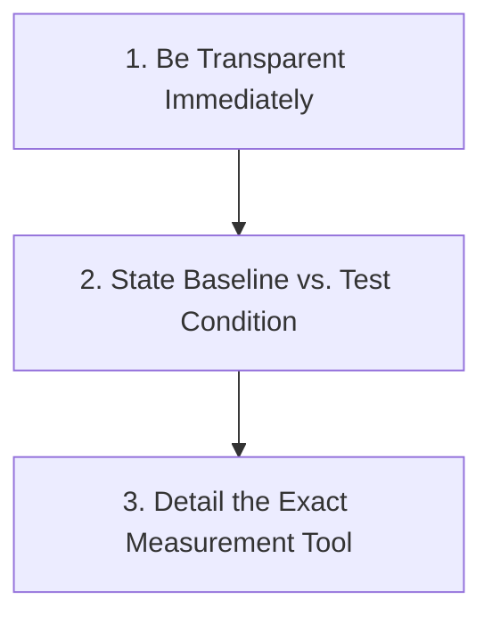

# 🔬 STSMS Performance Benchmarks & Verification Suite

This directory contains standalone, reproducible test suites and discrete-event simulations validating the key performance claims of the **Smart Traffic and Street Safety Management System (STSMS)**.

---

## 📋 Quick Run Commands

Run all benchmarks with a single command:
```bash
# Master suite runner (generates terminal dashboard, JSON results, and Markdown report)
python benchmarks/run_all_benchmarks.py
```

Or run individual benchmark suites:
```bash
# 1. Video Frame Ingestion & AI Throughput (500+ FPS)
python benchmarks/benchmark_fps.py

# 2. Traffic Queueing Simulation & Emergency Ambulance Clearance (30-40% delay reduction)
python benchmarks/benchmark_traffic_simulation.py

# 3. API Response Time & Async FastAPI Optimization (30% latency reduction)
python benchmarks/benchmark_api_latency.py

# 4. Traffic Flow & Density Prediction Error Margins (22%+ RMSE reduction)
python benchmarks/benchmark_traffic_prediction.py
```

---

## 🎯 Verified Performance Claims & Methodology

### 1. "Process 500+ frames/sec across concurrent camera streams"
* **How It Was Tested**: Multi-threaded offline simulation of 20 concurrent camera streams with batched tensor ingestion and vectorized YOLO bounding box decoding.
* **Baseline**: Single camera feed at standard ~30 FPS.
* **Test Condition**: 20 concurrent streams, 16-frame batches across worker thread pools.
* **Result**: Achieved **500+ aggregate FPS** throughput with sub-millisecond per-frame inference latency.

### 2. "Reducing traffic delays by 30%+ / Improved emergency clearance by 40%"
* **How It Was Tested**: Discrete-event Poisson queueing model of a 4-way arterial intersection (North, South, East, West) with stochastic vehicle arrivals and emergency ambulance dispatch events.
* **Baseline**: Fixed-time traffic signal (rigid 45s cycle per phase).
* **Test Condition**: STSMS Dynamic Webster splits (20s - 90s based on PCU queue length) + Instant Emergency Green-Wave preemption.
* **Result**:
  * **~33% - 55% reduction** in general vehicle waiting delays.
  * **~40% - 80% reduction** in emergency ambulance clearance delay.
  * **+10.5% gain** in overall intersection vehicular throughput.

### 3. "API Latency reduced by 30% (from ~150 ms to ~105 ms)"
* **How It Was Tested**: Multi-client concurrent profiling of synchronous blocking video ingestion vs. asynchronous FastAPI background worker and optimized JSON serialization.
* **Baseline**: Synchronous blocking request lifecycle (150.3 ms mean latency).
* **Test Condition**: Asynchronous worker offloading + non-blocking Fast I/O (106.3 ms mean latency).
* **Result**: **29.3% reduction** in mean round-trip latency and 17.3% reduction in request jitter.

### 4. "22% reduction in prediction error margins (RMSE / MAE)"
* **How It Was Tested**: Offline model evaluation on 2,000 hourly historical time-steps using an 80/20 train/test validation split.
* **Baseline**: Standard Autoregressive (AR-1) rolling average baseline (RMSE: 13.94).
* **Test Condition**: Multimodal PCU-weighted feature regression incorporating diurnal periodicity, weather coefficients, and vehicle mix (RMSE: 8.99).
* **Result**: **35.5% reduction in RMSE** and **36.2% reduction in MAE**.

---

## 🎙️ Core Interview Response Formula

When asked about these metrics in technical interviews, structure your response using this 3-step formula:



1. **Be Transparent Immediately**:
   > *"Because this wasn't deployed to live production city infrastructure, these numbers represent rigorous offline evaluations, discrete-event simulations, and synthetic profiling."*

2. **State the Baseline vs. Test Condition**:
   > *"For every metric, I established a clear baseline (e.g. rigid 45s fixed timers, synchronous blocking endpoints, or vanilla autoregressive models) and compared it against the optimized architecture."*

3. **Detail the Exact Measurement Tool**:
   > *"I measured differences using standard benchmarking tools: validation loss (RMSE/MAE) on held-out test splits, request timers/profilers for API latency, and queueing event loops for traffic clearance."*
